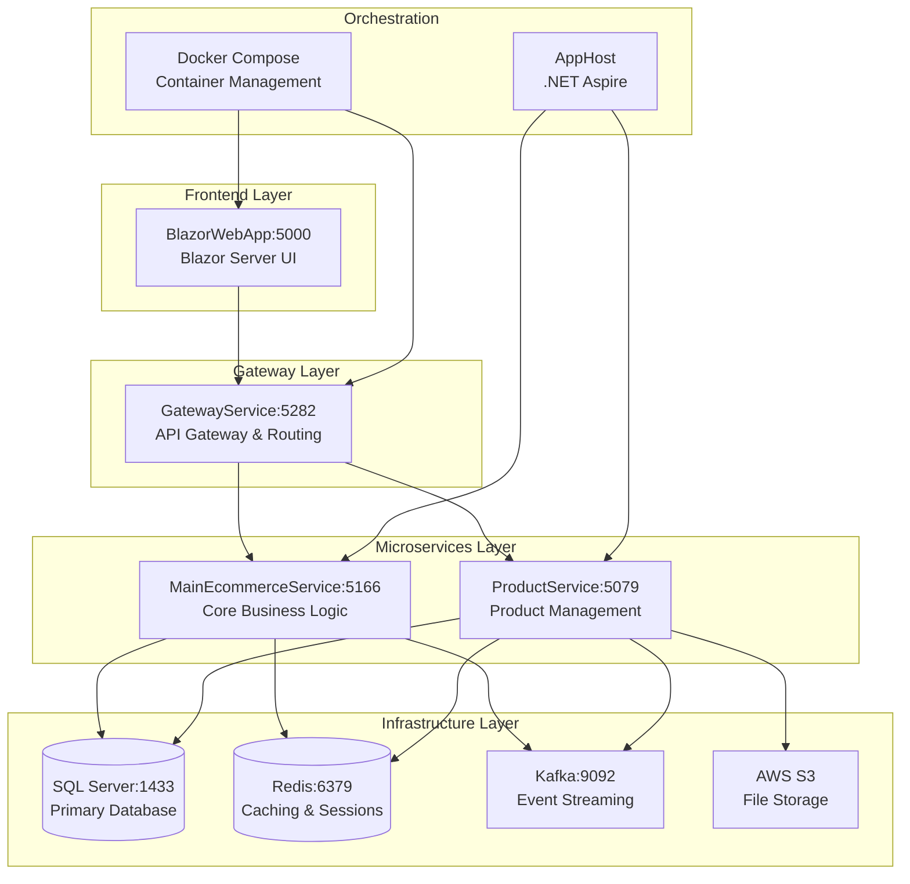

# DA_Ecommerce_MS - Distributed E-commerce Microservices Platform 🛒

[](https://dotnet.microsoft.com/)
[](https://blazor.net/)
[](https://microservices.io/)
[](https://docker.com/)
[](LICENSE)

## 📋 Tổng quan dự án

**DA_Ecommerce_MS** là một nền tảng thương mại điện tử phân tán được xây dựng với kiến trúc **Microservices** hiện đại, sử dụng **.NET 8.0**, **Blazor Server**, và các công nghệ **cloud-native**. Hệ thống hỗ trợ đa vai trò với dashboard riêng biệt cho **Admin**, **Seller**, **Shipper** và **Customer**.

## 🏗️ Kiến trúc hệ thống



## 🎯 Các Microservices

### 🌐 **GatewayService** - API Gateway (Port: 5282)
- **Chức năng**: Centralized routing, load balancing, authentication middleware
- **Công nghệ**: YARP (Yet Another Reverse Proxy)
- **Tính năng**:
  - Request routing và load balancing
  - CORS handling
  - Authentication middleware
  - Rate limiting
  - Health check aggregation

### 🏪 **MainEcommerceService** - Core Business Logic (Port: 5166)
- **Database**: SQL Server (MainEcommerceService DB)
- **Chức năng chính**:
  - 👤 **User Management**: Authentication, authorization, roles
  - 📦 **Order Management**: Order processing, status tracking
  - 📍 **Address Management**: User addresses, shipping info
  - 🎫 **Coupon System**: Discount codes, promotions
  - 🏬 **Seller Management**: Seller profiles, store management
  - 🚚 **Shipper Management**: Delivery assignment, tracking
  - 📊 **Dashboard Analytics**: Real-time metrics, reports
  - 🔔 **Real-time Notifications**: SignalR hubs

### 📦 **ProductService** - Product Management (Port: 5079)
- **Database**: SQL Server (ProductService DB)
- **Chức năng chính**:
  - 🛍️ **Product CRUD**: Create, read, update, delete products
  - 📂 **Category Management**: Product categorization
  - 🖼️ **Image Management**: AWS S3 integration
  - 🔍 **Search & Filtering**: Advanced product search
  - 📊 **Inventory Management**: Stock tracking, alerts
  - ⚡ **Caching**: Redis-based performance optimization

### 🖥️ **BlazorWebApp** - Frontend Application (Port: 5000)
- **Framework**: Blazor Server với SignalR
- **UI Components**: MudBlazor Material Design
- **Features**:
  - 📱 Responsive design
  - 🔄 Real-time updates
  - 👥 Multi-role dashboards
  - 🛒 Shopping cart & wishlist
  - 📱 Mobile-friendly interface

### 🎭 **AppHost** - Service Orchestration
- **Framework**: .NET Aspire
- **Chức năng**:
  - Service discovery và coordination
  - Container lifecycle management
  - Development environment setup
  - Health monitoring

## 🔧 Công nghệ sử dụng

### Backend Stack
| Công nghệ | Phiên bản | Mục đích |
|-----------|-----------|----------|
| **.NET** | 8.0 | Core framework |
| **Entity Framework Core** | 8.0 | ORM với Lazy Loading |
| **SignalR** | 8.0 | Real-time communication |
| **Apache Kafka** | 7.3.0 | Event streaming & messaging |
| **Redis** | 7.0 | Caching & session storage |
| **JWT Bearer** | - | Authentication & authorization |
| **AutoMapper** | - | Object-to-object mapping |
| **YARP** | - | Reverse proxy gateway |

### Frontend Stack
| Công nghệ | Mục đích |
|-----------|----------|
| **Blazor Server** | Server-side UI framework |
| **MudBlazor** | Material Design components |
| **SignalR Client** | Real-time UI updates |
| **Blazored.LocalStorage** | Client-side storage |
| **JavaScript Interop** | Device fingerprinting |

### Infrastructure Stack
| Công nghệ | Mục đích |
|-----------|----------|
| **SQL Server** | Primary database |
| **Docker** | Containerization |
| **Docker Compose** | Multi-container orchestration |
| **AWS S3** | Cloud file storage |
| **Swagger/OpenAPI** | API documentation |

## 🎭 Hệ thống đa vai trò

### 👨‍💼 Admin Dashboard (`/admin`)
- **User Management**: 
  - CRUD operations cho users
  - Role và permission management
  - User activity monitoring
- **Product Management**:
  - Category management
  - Product approval workflow
  - Inventory oversight
- **Order Management**:
  - Order processing oversight
  - Status updates và tracking
  - Refund và return handling
- **Seller Management**:
  - Seller approval process
  - Store verification
  - Performance monitoring
- **System Analytics**:
  - Sales reports và metrics
  - User behavior analytics
  - System health monitoring

### 🛍️ Seller Dashboard (`/seller`)
- **Store Management**:
  - Store profile và branding
  - Business information
  - Operating hours và policies
- **Product Management**:
  - Add/edit products
  - Inventory management
  - Product performance analytics
- **Order Processing**:
  - View assigned orders
  - Update order status
  - Customer communication
- **Sales Analytics**:
  - Revenue reports
  - Product performance metrics
  - Customer insights

### 🚚 Shipper Dashboard (`/shipper`)
- **Delivery Management**:
  - View assigned deliveries
  - Route optimization
  - Delivery status updates
- **Performance Tracking**:
  - Success rate metrics
  - Earnings tracking
  - Customer ratings
- **Real-time Updates**:
  - New assignment notifications
  - Route changes
  - Emergency alerts

### 🛒 Customer Experience
- **Product Discovery**:
  - Advanced search với filters
  - Category browsing
  - Product recommendations
- **Shopping Features**:
  - Shopping cart management
  - Wishlist functionality
  - Price comparison
- **Checkout Process**:
  - Multiple address support
  - Payment integration
  - Order confirmation emails
- **Order Tracking**:
  - Real-time status updates
  - Delivery tracking
  - Order history

## 📊 Tính năng nâng cao

### 🔄 Real-time System
- **SignalR Hubs**: 
  - Product updates
  - Order notifications
  - Live chat support
- **Redis Backplane**: Multi-instance sync
- **Live Dashboards**: Real-time metrics

### 📨 Event-Driven Architecture
- **Kafka Topics**:
  - Order events
  - Product updates
  - User activities
- **Event Sourcing**: Complete audit trail
- **Message Patterns**: Pub/Sub, Request/Reply

### 🗄️ Data Management
- **Database per Service**: Independent data stores
- **Redis Caching**: 
  - Product catalogs
  - User sessions
  - Shopping carts
- **Connection Pooling**: Optimized DB performance

### 🔒 Security Features
- **JWT Authentication**: Stateless auth tokens
- **Role-based Authorization**: Granular permissions
- **Device Fingerprinting**: Security tracking
- **Input Validation**: XSS và injection prevention
- **CORS Configuration**: Cross-origin security

## 🚀 Cài đặt và chạy

### Yêu cầu hệ thống
```bash
- .NET 8.0 SDK
- Docker Desktop 4.0+
- SQL Server 2019+ (hoặc Docker)
- 8GB RAM (khuyến nghị 16GB)
- 10GB dung lượng ổ cứng
```

### 1. Clone Repository
```bash
git clone https://github.com/yourusername/DA_Ecommer_MS.git
cd DA_Ecommer_MS
```

### 2. Cấu hình Environment Variables
Tạo file `.env` trong thư mục gốc:
```bash
# JWT Configuration
JWT_SECRET_KEY=YOUR_SUPER_SECRET_KEY_32_CHARACTERS_MIN
JWT_ISSUER=DA_Ecommerce_MS
JWT_AUDIENCE=ecommerce-users

# Database
SQL_SA_PASSWORD=YourStrong!Password123

# AWS (Optional)
AWS_ACCESS_KEY=your_aws_access_key
AWS_SECRET_KEY=your_aws_secret_key
```

### 3. Chạy với Docker Compose (Khuyến nghị)

#### Option A: Full Stack với Database
```bash
# Chạy tất cả services bao gồm SQL Server và Redis
docker-compose up -d --build

# Kiểm tra status
docker ps

# Xem logs
docker logs gateway_service
docker logs main_ecommerce_service
```

#### Option B: Chỉ chạy Infrastructure
```bash
# Chỉ chạy databases và Kafka
docker-compose up -d sqlserver redis kafka zookeeper

# Chạy services từ Visual Studio hoặc CLI
dotnet run --project AppHost
```

### 4. Khởi tạo Database

```bash
# Đợi SQL Server khởi động (30-60 giây)
sleep 60

# Chạy migrations (nếu cần)
dotnet ef database update --project MainEcommerceService
dotnet ef database update --project ProductService
```

### 5. Verify Installation

Kiểm tra các endpoints sau:

| Service | URL | Mô tả |
|---------|-----|-------|
| **Frontend** | http://localhost:5000 | Blazor Web App |
| **API Gateway** | http://localhost:5282/swagger | Gateway Swagger UI |
| **Main Service** | http://localhost:5166/swagger | Main API Swagger |
| **Product Service** | http://localhost:5079/swagger | Product API Swagger |
| **Kafka UI** | http://localhost:8090 | Kafka Management |

## 📁 Cấu trúc thư mục

```
DA_Ecommer_MS/
├── 📁 AppHost/                        # Service orchestration (.NET Aspire)
│   ├── Program.cs                     # Service discovery config
│   ├── kafka.yml                     # Kafka Docker compose
│   └── appsettings.json              # Aspire configuration
│
├── 📁 BlazorWebApp/                   # Frontend Blazor Server
│   ├── 📁 Pages/
│   │   ├── 📁 Admin/                  # Admin dashboard pages
│   │   │   ├── Dashboard.razor
│   │   │   ├── DashboardShipper.razor
│   │   │   └── 📁 Dialogs/
│   │   ├── 📁 Components/             # Shared UI components
│   │   ├── 📁 Customer/               # Customer-facing pages
│   │   └── 📁 Seller/                 # Seller dashboard pages
│   ├── 📁 Services/                   # HTTP client services
│   │   ├── LoginService.cs
│   │   ├── ProductService.cs
│   │   ├── OrderService.cs
│   │   └── SignalRService.cs
│   ├── 📁 ViewModel/                  # Data transfer objects
│   ├── 📁 wwwroot/js/                 # Client-side JavaScript
│   └── Program.cs                     # Blazor configuration
│
├── 📁 GateWayService/                 # API Gateway (YARP)
│   ├── Program.cs                     # Gateway routing config
│   ├── appsettings.json              # Gateway settings
│   └── appsettings.Docker.json       # Docker-specific config
│
├── 📁 MainEcommerceService/           # Core business service
│   ├── 📁 Controllers/                # REST API controllers
│   │   ├── UserLoginController.cs
│   │   ├── OrderController.cs
│   │   ├── DashboardController.cs
│   │   └── AddressController.cs
│   ├── 📁 Infrastructure/
│   │   ├── 📁 Services/               # Business logic services
│   │   ├── 📁 Repositories/           # Data access layer
│   │   └── 📁 UnitOfWork/            # Transaction management
│   ├── 📁 Models/                     # Entity models
│   ├── 📁 Hubs/                       # SignalR hubs
│   ├── 📁 Kafka/                      # Event handlers
│   ├── 📁 Migrations/                 # EF Core migrations
│   └── Program.cs                     # Service configuration
│
├── 📁 ProductService/                 # Product management service
│   ├── 📁 Controllers/                # Product API controllers
│   ├── 📁 Infrastructure/
│   │   └── 📁 Services/
│   │       ├── ProductService.cs      # Product business logic
│   │       ├── S3Service.cs          # AWS S3 integration
│   │       └── ImageService.cs       # Image processing
│   ├── 📁 Models/                     # Product entities
│   ├── 📁 Hubs/                       # Product notifications
│   ├── 📁 Kafka/                      # Product events
│   └── Program.cs                     # Service configuration
│
├── 📁 db_bap/                         # Database backups
│   ├── MainEcommerceService.bacpac
│   └── ProductService.bacpac
│
├── 🐳 docker-compose.yml              # Main Docker compose
├── 🐳 docker-compose.test.yml         # Test environment
├── 📄 .env                           # Environment variables
├── 📄 .gitignore                     # Git ignore rules
├── 📄 EcommerceMicroservices.sln     # Visual Studio solution
└── 📄 README.md                      # Project documentation
```

## 🔌 API Endpoints

### 🔐 Authentication APIs (`/main/api/UserLogin`)
```http
POST   /LoginUser              # User authentication
POST   /RegisterUser           # User registration  
PUT    /Logout                 # User logout
POST   /RefreshToken           # JWT token refresh
GET    /GetUserInfo            # Get user profile
PUT    /UpdateProfile          # Update user info
```

### 📦 Product APIs (`/product/api`)
```http
GET    /products               # Get all products (with pagination)
GET    /products/{id}          # Get product details
POST   /products               # Create product (Seller/Admin)
PUT    /products/{id}          # Update product (Seller/Admin)
DELETE /products/{id}          # Delete product (Admin)
POST   /products/upload-image  # Upload product images
GET    /categories             # Get product categories
POST   /categories             # Create category (Admin)
```

### 🛒 Order APIs (`/main/api/Order`)
```http
GET    /orders                 # Get orders (role-filtered)
POST   /CreateOrder            # Create new order
PUT    /{id}/status            # Update order status
GET    /{id}/items             # Get order items
GET    /{id}/tracking          # Track order delivery
POST   /{id}/cancel            # Cancel order
```

### 📍 Address APIs (`/main/api/Address`)
```http
GET    /GetAllAddresses        # Get user addresses
POST   /CreateAddress          # Add new address
PUT    /UpdateAddress          # Update existing address
DELETE /{id}                   # Delete address
PUT    /{id}/set-default       # Set default address
```

### 📊 Dashboard APIs (`/main/api/Dashboard`)
```http
GET    /admin/metrics          # Admin dashboard data
GET    /seller/sales           # Seller performance metrics
GET    /shipper/deliveries     # Shipper delivery stats
GET    /analytics/orders       # Order analytics
GET    /analytics/revenue      # Revenue reports
```

## 🌟 Tính năng nổi bật

### 🛒 E-commerce Core
- **Product Catalog**: 
  - Multi-category support
  - Advanced search với Elasticsearch-style filtering
  - Product variants (size, color, etc.)
  - Bulk import/export
- **Shopping Experience**:
  - Persistent shopping cart
  - Wishlist management
  - Product comparison
  - Recently viewed products
- **Checkout Process**:
  - Guest checkout support
  - Multiple shipping addresses
  - Payment gateway integration
  - Order confirmation emails

### 📊 Business Intelligence
- **Real-time Analytics**:
  - Sales performance dashboards
  - Customer behavior tracking
  - Inventory movement analysis
  - Revenue forecasting
- **Reporting System**:
  - Automated daily/weekly/monthly reports
  - Custom date range reports
  - Export to Excel/PDF
  - Email report scheduling

### 🔄 Real-time Features
- **Live Notifications**:
  - Order status updates
  - Inventory alerts
  - System maintenance notifications
  - Customer support messages
- **Dynamic Updates**:
  - Live price changes
  - Stock level updates
  - Order tracking updates
  - Dashboard metric refresh

### 🔐 Advanced Security
- **Authentication**:
  - JWT with refresh tokens
  - Multi-factor authentication support
  - Social login integration ready
  - Password complexity enforcement
- **Authorization**:
  - Role-based access control (RBAC)
  - Resource-based permissions
  - API rate limiting
  - Request validation

## 🚢 Deployment

### 🐳 Docker Production Deploy

1. **Tạo production docker-compose**:
```yaml
# docker-compose.prod.yml
version: '3.8'
services:
  gateway:
    image: da-ecommerce/gateway:latest
    ports:
      - "80:8080"
    environment:
      - ASPNETCORE_ENVIRONMENT=Production
```

2. **Build và deploy**:
```bash
# Build production images
docker-compose -f docker-compose.prod.yml build

# Deploy
docker-compose -f docker-compose.prod.yml up -d
```

### ☁️ Cloud Deployment (Azure/AWS)

#### Azure Container Apps
```bash
# Login to Azure
az login

# Create resource group
az group create --name rg-ecommerce --location eastus

# Deploy container apps
az containerapp up --resource-group rg-ecommerce --name ecommerce-gateway
```

#### AWS ECS
```bash
# Create ECS cluster
aws ecs create-cluster --cluster-name ecommerce-cluster

# Deploy services
aws ecs create-service --cluster ecommerce-cluster --service-name gateway
```

## 🧪 Testing

### Unit Tests
```bash
# Run all tests
dotnet test

# Run with coverage
dotnet test --collect:"XPlat Code Coverage"
```

### Integration Tests
```bash
# Start test environment
docker-compose -f docker-compose.test.yml up -d

# Run integration tests
dotnet test --filter "Category=Integration"
```

### Load Testing
```bash
# Using Artillery.js
npm install -g artillery
artillery run load-test.yml
```

## 📈 Performance Monitoring

### Health Checks
- **Built-in endpoints**: `/health`, `/health/ready`, `/health/live`
- **Custom checks**: Database connectivity, Redis availability, Kafka status
- **Metrics**: Response times, error rates, throughput

### Logging
- **Structured logging** với Serilog
- **Centralized logs** với ELK Stack (Elasticsearch, Logstash, Kibana)
- **Log levels**: Debug, Info, Warning, Error, Critical

### Metrics
- **Application metrics**: Custom counters, timers, gauges
- **Infrastructure metrics**: CPU, memory, disk usage
- **Business metrics**: Orders per minute, revenue tracking

## 🤝 Contributing

### Development Workflow
1. **Fork** repository
2. **Create feature branch**: `git checkout -b feature/amazing-feature`
3. **Make changes** với proper testing
4. **Commit**: `git commit -m 'Add amazing feature'`
5. **Push**: `git push origin feature/amazing-feature`
6. **Create Pull Request**

### Code Standards
- **C# Coding Guidelines**: Microsoft standards
- **API Design**: RESTful principles
- **Database**: Entity Framework conventions
- **Testing**: Minimum 80% code coverage

### Review Process
- **Automated checks**: Build, tests, security scan
- **Code review**: Minimum 2 reviewers
- **Documentation**: Update README và API docs
- **Testing**: Integration tests required

## 📞 Support và Community

### 🐛 Bug Reports
- **GitHub Issues**: [Create new issue](https://github.com/yourusername/DA_Ecommer_MS/issues)
- **Template**: Bug report template provided
- **Labels**: bug, enhancement, question, etc.

### 📚 Documentation
- **API Documentation**: Swagger UI tại `/swagger`
- **Wiki**: [Project Wiki](https://github.com/yourusername/DA_Ecommer_MS/wiki)
- **Tutorials**: Step-by-step guides

### 💬 Community
- **Discussions**: GitHub Discussions
- **Discord**: [Join our Discord](https://discord.gg/yourinvite)
- **Stack Overflow**: Tag với `da-ecommerce-ms`

## 📄 License

Dự án này được phân phối dưới **MIT License**. Xem file [LICENSE](LICENSE) để biết thêm chi tiết.

## 🙏 Acknowledgments

### Công nghệ và Framework
- **[.NET Team](https://github.com/dotnet)** - Excellent development platform
- **[MudBlazor](https://mudblazor.com/)** - Beautiful Blazor components
- **[Apache Kafka](https://kafka.apache.org/)** - Reliable event streaming
- **[Redis](https://redis.io/)** - High-performance caching
- **[YARP](https://github.com/microsoft/reverse-proxy)** - .NET reverse proxy

### Inspiration
- **Microservices patterns** từ Martin Fowler
- **Clean Architecture** từ Uncle Bob
- **Domain-Driven Design** principles

---

## 📊 Project Stats


---

⭐ **Nếu dự án này hữu ích, hãy cho chúng tôi một Star!** ⭐

**Made with ❤️ by [Your Name](https://github.com/yourusername)**

---

*Cập nhật lần cuối: Tháng 6, 2025*
